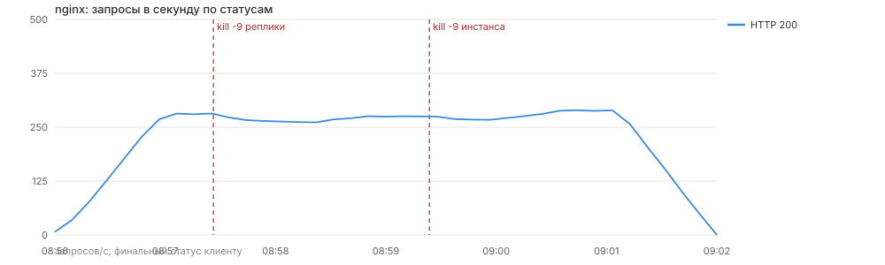
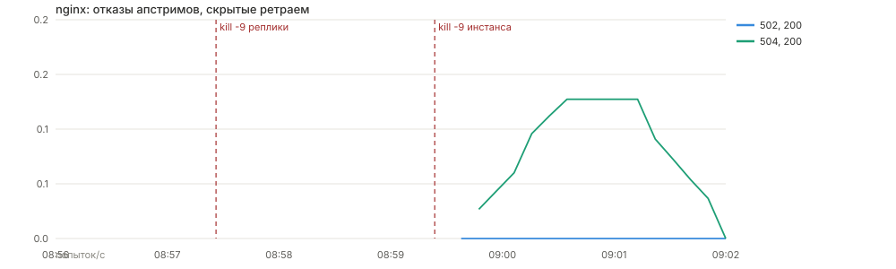
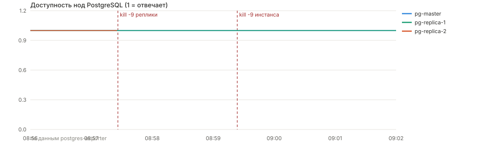
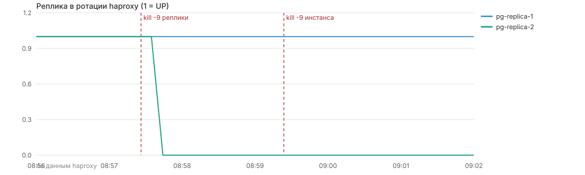
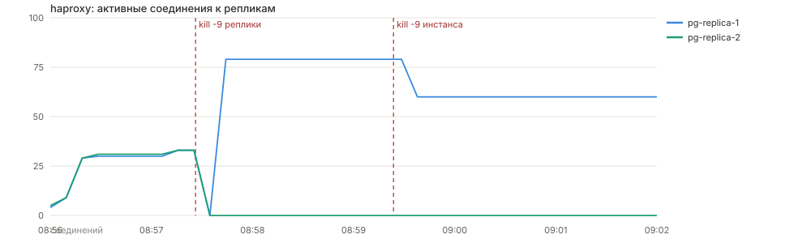
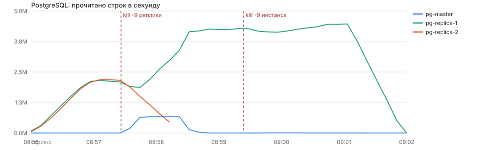
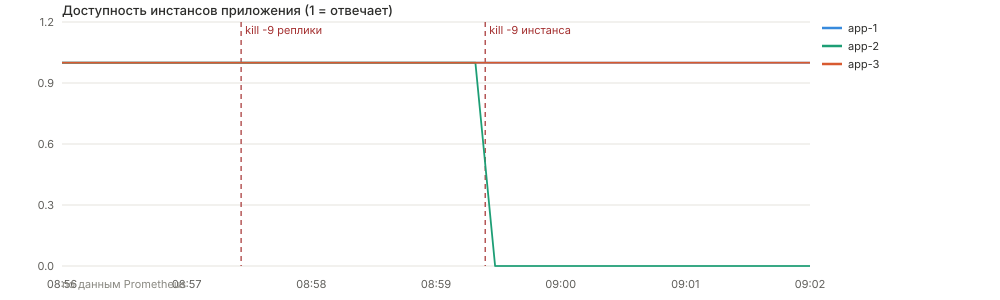
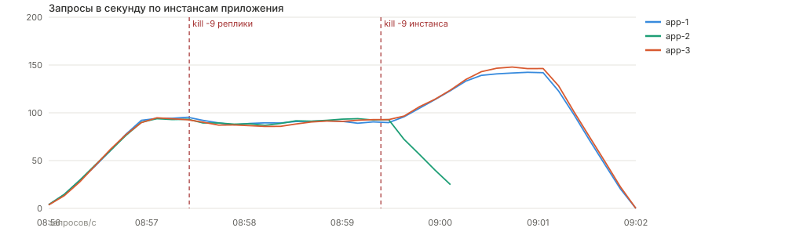

# Балансировка: nginx перед инстансами приложения, haproxy перед репликами PostgreSQL

## Стенд

- PostgreSQL 18.4: `pg-master` + `pg-replica-1` + `pg-replica-2`, потоковая репликация со слотами,
  кворумная синхронная репликация `ANY 1 (replica_1, replica_2)` — всё в [docker-compose.yml](../docker-compose.yml)
- haproxy 3.2, слушает 5001, бэкенд `pg_read` = обе реплики, `balance leastconn`,
  `option pgsql-check user postgres`, `inter 2s fall 2`, `on-marked-down shutdown-sessions`,
  статистика на :8404 — [docker/haproxy/haproxy.cfg](../docker/haproxy/haproxy.cfg)
- Три инстанса приложения `app-1..3`, наружу торчит только nginx :8090,
  `upstream app_backend` c `least_conn`, `max_fails=2 fail_timeout=5s`, `proxy_next_upstream` —
  [docker/nginx/nginx.conf](../docker/nginx/nginx.conf)
- Строка подключения одна на все инстансы: `Host=pg-master:5432,haproxy:5001;...;Maximum Pool Size=30`.
  Хост выбирает Npgsql по `TargetSessionAttributes` в [DbClient.cs](../src/backend/PeopleHub.Infrastructure/Db/DbClient.cs):
  `Primary` для записи → мастер напрямую, `PreferStandby` для чтения → haproxy
- Данные: 1 млн пользователей, GIN-индекс `gin_trgm_ops` по surname/name
- Нагрузка: [balance.js](../load-testing/balance.js), k6 v2.1.0, 120 VU (30 с разгон + 300 с плато),
  сценарий чтения — `GET /user/search` с прокруткой по страницам + точечные `GET /user/{id}`
- Машина: 22 ядра, все ноды делят её между собой
- Схема взаимодействия — [haproxy-nginx.md](haproxy-nginx.md)
- Метрики: Prometheus собирает приложение (`UseHttpMetrics`), haproxy (нативный экспортёр),
  PostgreSQL (`postgres-exporter` на каждой ноде) и nginx (`nginx-log-exporter`),
  дашборда Grafana «People Hub» — [docker/grafana/dashboards/people-hub.json](../docker/grafana/dashboards/people-hub.json)

Стенд поднимался с нуля: `docker compose down` + `docker compose up -d --build`.

## Сценарий отказов

1. Прогреваем нагрузку, снимаем базовую линию
2. `docker kill -s KILL pg-replica-2` (эквивалент `kill -9` для процесса в контейнере)
3. Через 2 минуты `docker kill -s KILL people-hub-app-2`
4. Смотрим статистику haproxy, access-log nginx с `upstream_addr`/`upstream_status` и CPU по нодам

## Результаты

Прогон 31.07.2026: `kill -9` реплики в 08:57:51, `kill -9` инстанса приложения в 08:59:55.
Убитые ноды обратно не поднимались — до конца прогона система работала в урезанном составе.

**88 384 запроса, 0 ошибок у клиента**, медиана 61 мс, p95 447 мс, p99 747 мс, 265 rps.

| Фаза | Ответы клиенту | Ошибки |
|---|---|---|
| Базовая линия (до отказов) | 24 528 × 200 | нет |
| После `kill -9` реплики (2 мин) | 33 304 × 200 | нет |
| После `kill -9` инстанса (до конца) | 29 553 × 200 | нет |

Графики ниже построены теми же PromQL-запросами, что стоят на дашборде Grafana «People Hub»
(скрипт [render-charts.js](../load-testing/render-charts.js)). Красные пунктиры — моменты `kill -9`.

### Главное: поток запросов не прерывался



Единственная линия на графике — HTTP 200. Ни одного ответа 5xx за весь прогон: после разгона
система держит ~270 запросов/с и проходит через оба отказа без провала. Спад в конце — это
завершение самого теста, а не отказ.

### Цена отказов, которую клиент не увидел



Здесь видно, что отказы всё-таки были: 27 попыток из 88 384 упёрлись в мёртвый инстанс и
получили 502 или 504. Все они были повторены на живом инстансе и вернули клиенту 200 —
в логе это выглядит как `upstream_status="502, 200"`. Цена — до 2–3 с латентности на этих
единичных запросах, что и даёт максимум 2.9 с при p99 в 747 мс.

### Отказ реплики PostgreSQL





`pg-replica-2` уходит в ноль мгновенно, haproxy выводит её из ротации следом. Точное время —
из лога haproxy (часы контейнера в UTC, kill в 08:57:51 MSK = 05:57:51 UTC):

```
2026-07-31T05:58:00.499Z  Server pg_read/pg-replica-2 is DOWN,
                          reason: Layer4 timeout, check duration: 2004ms.
                          1 active and 0 backup servers left.
```

**9.5 с** от `kill -9` до вывода ноды из ротации. В предыдущих прогонах той же конфигурации
было 7.9 и 8.6 с — разброс зависит от того, в какую фазу цикла проверок попадает отказ.
Расчётный диапазон при `inter 2s fall 2` и мёртвом контейнере (каждая проверка висит полный
таймаут 2 с, нужны две подряд неудачные) — 6–10 с.





Соединения убитой реплики обнуляются, у выжившей — удваиваются; читающая нагрузка целиком
переезжает на неё. Мастер (нижняя линия) в чтении почти не участвует ни до, ни после отказа —
`PreferStandby` не возвращает чтение на primary, пока жива хоть одна реплика.

### Отказ инстанса приложения





`app-2` пропадает, его доля трафика мгновенно расходится по двум оставшимся: было ~90 запросов/с
на каждом из трёх, стало ~135 на каждом из двух. Суммарный поток не просел — это видно на
первом графике. Сессии не рвутся: ключи DataProtection общие в Redis, поэтому авторизованный
пользователь не замечает, что его переключили на другой инстанс.

## Что пришлось починить по дороге

Первые прогоны показали, что балансировка работает, а вот приложение к отказам не готово.
Это диагностические итерации, их сырые выгрузки в репозитории не хранятся — только результат
и найденная причина.

| Прогон | Условия | Ошибки | Что нашли |
|---|---|---|---|
| 1 | 300 VU, пул Npgsql по умолчанию | 10.7 % | `53300: sorry, too many clients already` — 3 инстанса × пул 100 против `max_connections=100` на реплике |
| 2 | 300 VU, пул 30 | 52.2 % | `ObjectDisposedException` в `ResetCancellation`: `DataReader` не закрывался |
| 3 | 300 VU, ридеры закрыты + ретрай | 47.9 % | стенд упёрся в потолок |
| 4 | 120 VU | 1.93 % | остаточный фон тех же ошибок — `DataTable.Load` читает синхронно поверх async-соединения |
| 5 | 120 VU, чтение через `ReadAsync`, haproxy `leastconn` | 0.01 % | чисто |

Изменения в коде и конфигах:

1. `Maximum Pool Size=30` на инстанс — 3 × 30 = 90 соединений переживают отказ любой реплики,
   не упираясь в `max_connections=100`
2. Закрытие `DataReader` и одна повторная попытка для read-only команд
3. Чтение строк через `ReadAsync` вместо `DataTable.Load` — смешивание синхронного чтения
   с асинхронным соединением ломало коннектор Npgsql под нагрузкой даже без отказов
4. haproxy переведён с `roundrobin` на `leastconn`: соединения к БД живут долго, и roundrobin
   разложил их 70/13, а leastconn — ровно 29/28
5. Healthcheck tarantool проверяет наличие UDF, а не только ping: на холодном старте `chats`
   успевал подключиться раньше, чем `init.lua` регистрировал функции, и падал вместе со всем стеком

## Выводы

1. **Отказ реплики прозрачен для клиента при наличии запаса мощности.** haproxy убирает мёртвую
   ноду за 6–10 с по `pgsql-check`, рвёт зависшие сессии, чтение идёт на выжившую реплику.
   На 120 VU — ноль ошибок из 88 384 запросов.
2. **Отказ инстанса приложения не виден клиенту вообще.** Запросы, летевшие в убитый инстанс,
   nginx повторяет на живом (`upstream_status=504, 200`); цена — пара секунд латентности
   на 27 запросах из 88 тысяч.
3. **Балансировка не добавляет мощности.** Все ноды делят CPU одной машины, поэтому нагрузку
   надо выбирать с запасом: после потери реплики оставшаяся должна тянуть весь трафик одна.
   На 120 VU запас есть, на 300 VU стенд уже на потолке и отказ реплики его роняет.
4. **Отказ инфраструктуры вскрывает баги приложения.** Три из пяти черновых прогонов провалились
   не из-за nginx или haproxy, а из-за того, как приложение обращалось с соединениями:
   незакрытые ридеры, синхронное чтение поверх async, пул больше лимита сервера.
