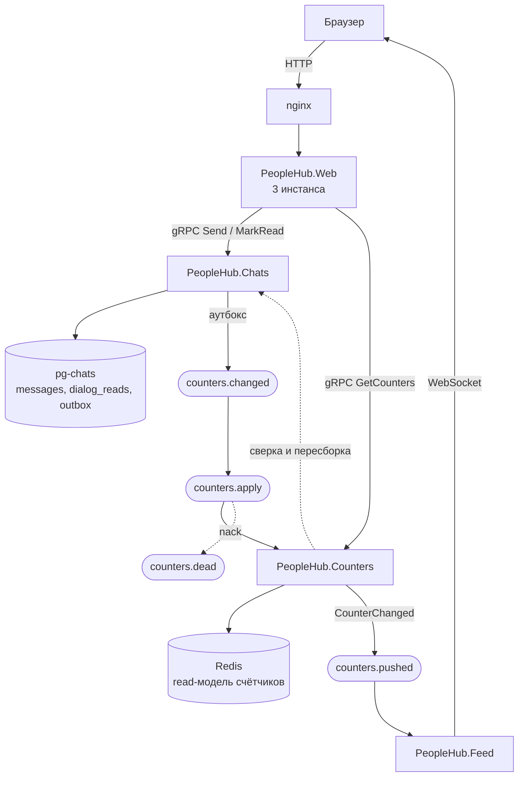

# ДЗ «Сервис счётчиков» — отчёт

## 1. Исходный код

Репозиторий: <https://github.com/soweneer/otus.people-hub>

Ветка с работой: `feature/saga`.

Задание закрывают семь коммитов, по одному на этап:

| Коммит | Что вошло |
|---|---|
| `518c3e2` | Транзакционный аутбокс и отметки прочтения в сервисе диалогов |
| `48827a7` | Публикация событий аутбокса в RabbitMQ |
| `15e7b26` | Сервис счётчиков `PeopleHub.Counters` на Redis |
| `ee56413` | Метрики счётчиков и аутбокса в Prometheus, панели в Grafana |
| `20a7cc6` | Отображение счётчиков в приложении |
| `28cc7ae` | Сверка счётчиков с сервисом диалогов |
| `9702f36` | Нагрузочный тест и отчёт по результатам |

## 2. Запуск

Всё поднимается одной командой из корня репозитория:

```bash
APP_RUN_MIGRATIONS=true docker compose up -d --build
```

`APP_RUN_MIGRATIONS=true` нужен только при первом запуске — он создаёт схему
монолита. Схема сервиса диалогов (`messages`, `dialogs`, `dialog_reads`, `outbox`)
накатывается при старте контейнера `chats` сама. Если база монолита уже создана,
достаточно `docker compose up -d --build`.

Что открыто наружу:

| Адрес | Что это |
|---|---|
| <http://localhost:8090> | приложение через nginx |
| <http://localhost:8090/swagger> | Swagger монолита |
| <http://localhost:3000> | Grafana, дашборд «People Hub», строка «Счётчики непрочитанного» |
| <http://localhost:9090> | Prometheus |
| <http://localhost:15672> | RabbitMQ (guest / guest) |
| `localhost:8083` / <http://localhost:8093/metrics> | gRPC и метрики сервиса счётчиков |
| `localhost:8081` / <http://localhost:8091/metrics> | gRPC и метрики сервиса диалогов |

### Как увидеть счётчики

1. Зарегистрировать двух пользователей через `/signup`, подружить их.
2. Войти первым, написать второму в разделе «Диалоги».
3. Войти вторым в другом браузере: в навигации и в списке диалогов появится бейдж
   с числом непрочитанных — он приезжает по WebSocket, без перезагрузки страницы.
4. Открыть диалог — счётчик обнулится.

Через API то же самое проверяется двумя запросами:

```bash
curl -X POST "http://localhost:8090/dialog/<recipient>/send" -H "Authorization: Bearer <token>" -H "Content-Type: application/json" -d '{"text":"привет"}'
```

```bash
curl "http://localhost:8090/api/counters/unread" -H "Authorization: Bearer <recipient-token>"
```

Токен выдаёт `POST /login`. Ответ второго запроса — `{"counters":[{"partnerId":…,"count":1}],"total":1}`.

### Нагрузочный сценарий

```bash
k6 run load-testing/counters.js
```

Сценарий одновременно читает счётчики, читает сам диалог (как считал бы наивный
клиент) и пишет новые сообщения. Глубину переписки задаёт `UNREAD_PER_PAIR`.

## 3. Архитектура

### Схема



### Словесное описание

**Сервис счётчиков — отдельный процесс без своей базы.** `PeopleHub.Counters`
хранит состояние в Redis, а источником истины остаётся `pg-chats` — база сервиса
диалогов. Своя БД сервису не заводилась осознанно: счётчик непрочитанного целиком
выводится из сообщений и отметок прочтения, поэтому дублировать эти данные в третьем
хранилище значило бы добавить ещё одну точку рассинхронизации без выигрыша.

**Нагрузка на чтение.** Счётчики в Redis разложены так, что чтение — это один
`HGETALL` по ключу пользователя, без обращения к PostgreSQL и без зависимости от
размера переписки. На глубоких диалогах (около 1000 непрочитанных) это даёт p95
56 мс против 100 мс у наивного пересчёта из самой переписки; внутри сервиса,
без HTTP-обвязки, p95 — 10.8 мс. Сервис счётчиков и сервис диалогов масштабируются
независимо: у первого нагрузка читающая, у второго пишущая.

**Консистентность через сагу.** Реализована хореографическая сага, без оркестратора.
Запись сообщения и событие для счётчика попадают в `pg-chats` одной транзакцией
(таблицы `messages` и `outbox` лежат в одной базе), поэтому двойной записи нет и
событие не может потеряться при падении между сохранением и отправкой. Отдельный
воркер разгребает аутбокс батчами через `for update skip locked` и публикует в
RabbitMQ. Сервис счётчиков применяет событие Lua-скриптом в Redis: `ZADD` по
идентификатору сообщения и `ZREMRANGEBYSCORE` по отметке прочтения — обе операции
идемпотентны, поэтому повторная доставка безопасна, а порядок событий не важен.

**Компенсация — не откат, а пересборка.** Уменьшать счётчик обратно бессмысленно:
если событие потерялось, состояние Redis уже не соответствует базе. Поэтому
компенсирующее действие — пересборка состояния пользователя из сервиса диалогов
по `Dialogs/GetUnreadState`. Она запускается по трём поводам: событие не применилось
и ушло в `counters.dead`; фоновая сверка раз в минуту нашла расхождение с
`Dialogs/GetUnreadCounts`; чтение не нашло в Redis отметки `synced` — это путь
восстановления после полной потери Redis.

**Отображение.** Монолит ходит в сервис счётчиков по gRPC и отдаёт
`GET /api/counters/unread`; при недоступности сервиса гейтвей возвращает нули, а не
ошибку — бейдж пропадает, страница работает. Обновления не опрашиваются: сервис
счётчиков публикует `CounterChanged`, а `PeopleHub.Feed` ретранслирует их в тот же
WebSocket, через который уже ходят события ленты.

**Наблюдаемость.** Оба сервиса отдают метрики Prometheus на отдельном порту
(gRPC и `/metrics` разведены, потому что Kestrel не поднимает h2c на смешанном
plaintext-эндпоинте). В дашборде Grafana есть строка «Счётчики непрочитанного»:
латентность чтения, скорость применения событий вместе с dead-letter и расхождениями,
отставание аутбокса.

Подробный разбор с замерами, графиками и найденными под нагрузкой дефектами —
в [counters-service.md](counters-service.md). Контракт сервиса диалогов —
в [dialogs-service.md](dialogs-service.md).
