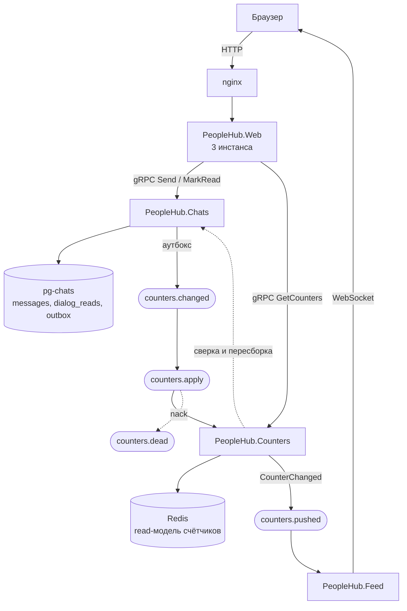

# Сервис счётчиков, описание

## Запуск

Всё поднимается одной командой из корня репозитория:

```bash
APP_RUN_MIGRATIONS=true docker compose up -d --build
```

`APP_RUN_MIGRATIONS=true` нужен только при первом запуске — он создаёт БД
монолита. БД сервиса диалогов (`messages`, `dialogs`, `dialog_reads`, `outbox`)
накатывается при старте контейнера `chats` сама. Если база монолита уже создана,
достаточно `docker compose up -d --build`.

### Что где живет

| URL |  |
|---|---|
| <http://localhost:8090> | приложение |
| <http://localhost:8090/swagger> | Swagger монолита |
| <http://localhost:3000> | Grafana |
| <http://localhost:9090> | Prometheus |
| <http://localhost:15672> | RabbitMQ (guest / guest) |
| <http://localhost:8093/metrics> | метрики сервиса счётчиков |
| <http://localhost:8091/metrics> | метрики сервиса диалогов |

### Как увидеть счётчики

1. Зарегистрировать двух пользователей через `/signup`, подружить их.
2. Войти первым, написать второму в разделе «Диалоги».
3. Войти вторым в другом браузере: в навигации и в списке диалогов появится бейдж
   с числом непрочитанных — он приезжает по WebSocket, без перезагрузки страницы.
4. Открыть диалог — счётчик обнулится.

Через API то же самое проверяется двумя запросами:

```bash
curl -X POST "http://localhost:8090/dialog/<recipient>/send" -H "Authorization: Bearer <token>" -H "Content-Type: application/json" -d '{"text":"привет"}'
```

```bash
curl "http://localhost:8090/api/counters/unread" -H "Authorization: Bearer <recipient-token>"
```

Токен выдаёт `POST /login`. Ответ второго запроса — `{"counters":[{"partnerId":…,"count":1}],"total":1}`.

### Нагрузочный сценарий

```bash
k6 run load-testing/counters.js
```

Сценарий одновременно читает счётчики, читает сам диалог (как считал бы наивный
клиент) и пишет новые сообщения. Глубину переписки задаёт `UNREAD_PER_PAIR`.

## 3. Архитектура



### Описание

**Сервис счётчиков — отдельный процесс без своей базы.** Он
хранит состояние в Redis, а источником истины остаётся `pg-chats` — сервис
диалогов.

**Реализована хореографическая сага, без оркестратора.** По сути, оркестрировать здесь нечего - участник, меняющий состояние - ровно один.
Запись сообщения и событие для счётчика попадают в `pg-chats` одной транзакцией
(таблицы `messages` и `outbox` лежат в одной базе). Отдельный
воркер разгребает аутбокс батчами и прокидывает сообщения в
RabbitMQ. Сервис счётчиков применяет событие Lua-скриптом в Redis: `ZADD` по
идентификатору сообщения и `ZREMRANGEBYSCORE` по отметке прочтения — обе операции
идемпотентны, поэтому повторная доставка безопасна, а порядок событий не важен.

**Компенсация:** Уменьшать счётчик обратно бессмысленно:
если событие потерялось, состояние Redis уже не соответствует базе. Поэтому
компенсирующим действием была выбрана пересборка состояния пользователя из сервиса диалогов
по `Dialogs/GetUnreadState`. Запускается при трех кейсах:
* событие не применилось и ушло в `counters.dead`
* фоновая сверка раз в минуту нашла расхождение с `Dialogs/GetUnreadCounts`
* чтение не нашло в Redis отметки `synced`

**Отображение.** Монолит ходит в сервис счётчиков по gRPC и отдаёт
`GET /api/counters/unread`; при недоступности сервиса гейтвей возвращает нули, а не
ошибку — бейдж с кол-вом непрочитанных на UI пропадает, страница работает. Обновления не опрашиваются: сервис
счётчиков публикует `CounterChanged`, а `PeopleHub.Feed` ретранслирует их в тот же
WebSocket, через который уже ходят события ленты.

**Мониторинг.** Оба сервиса отдают метрики Prometheus на отдельном порту. В графане  настроены метрики (секция «Счётчики непрочитанного»):
* латентность чтения
* скорость применения событий вместе с dead-letter и расхождениями
* отставание аутбокса
