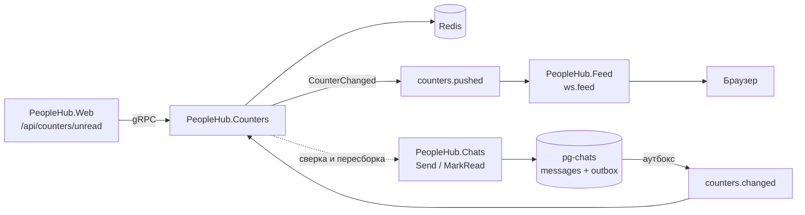
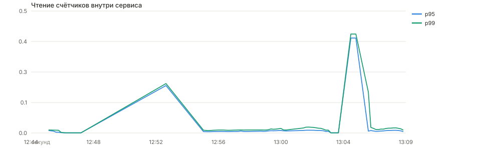
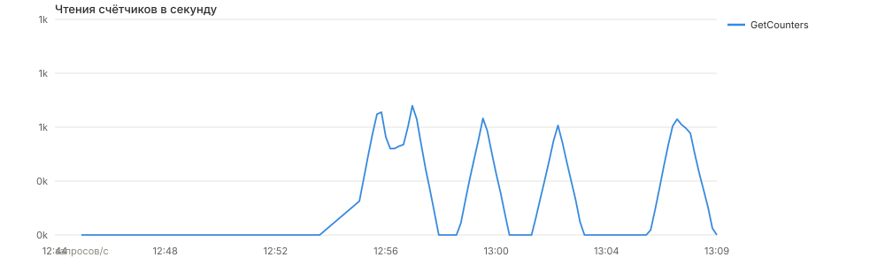
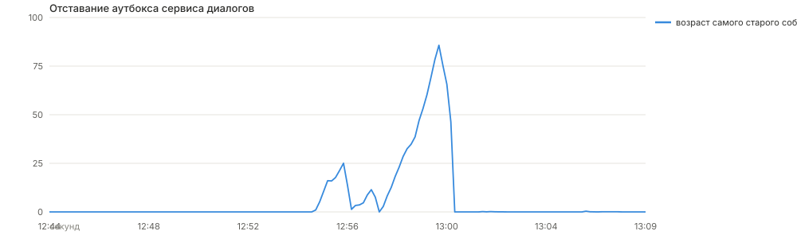
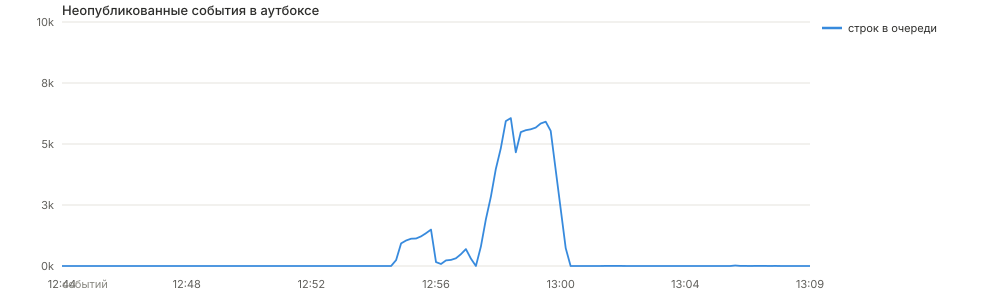
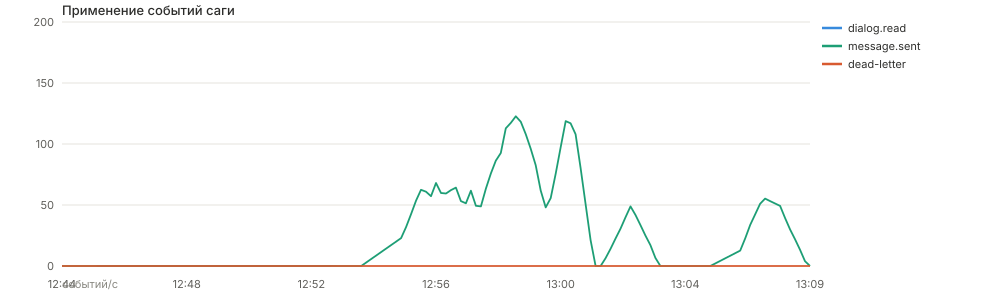

# Сервис счётчиков

Счётчик непрочитанных сообщений вынесен в отдельный сервис `PeopleHub.Counters`.
Он не имеет своей базы: состояние живёт в Redis, а источником истины остаётся
`pg-chats` — база сервиса диалогов. Такое разделение позволяет отвечать на чтение
за один запрос в Redis и при этом восстанавливать любое состояние из диалогов.

## Как устроено



Запись сообщения и событие для счётчика попадают в одну транзакцию `pg-chats`:
`messages` и `outbox` — таблицы одной базы, поэтому двойной записи нет. Фоновый
публикатор разгребает аутбокс батчами через `for update skip locked`, так что
несколько инстансов сервиса диалогов работают параллельно без координации.

## Модель данных в Redis

Наивный счётчик «одно число на пользователя» ломается на дубликатах и
переупорядоченных событиях. Здесь на пару собеседников хранится множество
идентификаторов непрочитанных сообщений, а число рядом — производная от него:

| Ключ | Тип | Назначение |
|---|---|---|
| `unread:{U}` | hash | счётчик по каждому собеседнику, поле `total`, отметка `synced` |
| `unread:{U}:read` | hash | watermark прочтения по каждому собеседнику |
| `unread:{U}:<P>` | zset | идентификаторы непрочитанных сообщений от собеседника `P` |

Применение события — Lua-скрипт целиком: `ZADD` по идентификатору сообщения и
`ZREMRANGEBYSCORE` по watermark прочтения. Обе операции идемпотентны сами по себе,
поэтому повторная доставка из RabbitMQ ничего не портит, а порядок событий не важен.
Хеш `unread:{U}` обновляется в том же скрипте и служит read-моделью: чтение
счётчиков — это один `HGETALL`, без обращения к zset и без похода в PostgreSQL.

Именно из-за порядка событий здесь хранятся идентификаторы, а не одно число.
Вариант «событие прочтения несёт готовое количество, сервис его присваивает»
разваливается на гонке: сообщение, закоммиченное после снимка транзакции
`MarkRead`, но опубликованное раньше события прочтения, было бы затёрто.

## Нагрузка

`load-testing/counters.js` гоняет три сценария одновременно: чтение счётчиков,
чтение самого диалога (как считал бы наивный клиент — беря переписку и пересчитывая)
и запись новых сообщений.

```bash
k6 run load-testing/counters.js
```

Мелкие диалоги, около 50 сообщений на пару, 40 VU на счётчики, 10 на диалоги,
5 на запись, 60 секунд — 48 375 запросов, 802 rps, ноль ошибок:

| Запрос | avg | med | p90 | p95 | p99 | max |
|---|---|---|---|---|---|---|
| `GET /api/counters/unread` | 15.33 мс | 12.88 | 25.53 | 31.23 | 45.16 | 139.58 |
| `GET /dialog/{id}/list` | 19.93 мс | 17.26 | 31.46 | 37.55 | 55.80 | 195.24 |
| `POST /dialog/{id}/send` | 26.90 мс | 23.52 | — | 51.73 | — | — |

Глубокие диалоги, около 1000 непрочитанных на пару, 90 секунд — 60 324 запроса,
667 rps, ноль ошибок:

| Запрос | avg | med | p90 | p95 | p99 | max |
|---|---|---|---|---|---|---|
| `GET /api/counters/unread` | 24.68 мс | 19.89 | 45.26 | 56.16 | 87.22 | 203.30 |
| `GET /dialog/{id}/list` | 55.71 мс | 50.89 | 83.30 | 99.98 | 144.81 | 220.30 |
| `POST /dialog/{id}/send` | 41.97 мс | 36.13 | 70.79 | 85.76 | 132.72 | 200.04 |

Разрыв между счётчиком и наивным пересчётом растёт вместе с историей переписки:
на мелких диалогах это 1.3 раза, на глубоких — 2.3 раза по p95. Причина именно в
объёме работы: `HGETALL` не зависит от размера диалога, а выборка переписки
зависит линейно.

Цифры выше сняты с внешнего HTTP-контура и включают nginx, монолит и gRPC-хоп.
Сам сервис счётчиков отвечает быстрее: p95 — 10.8 мс, p99 — 20.4 мс, применение
одного события в Redis — p95 7.9 мс.





## Что показал нагрузочный тест

**Публикатор аутбокса упирался в подтверждения.** Первый прогон на глубоких
диалогах загнал аутбокс в долг: 6061 неопубликованное событие и отставание
85.7 секунды при скорости разгребания около 108 событий в секунду. Причина —
каждое сообщение публиковалось и подтверждалось по отдельности, то есть один
round-trip до брокера на событие. После перехода на батч (публикуем всю пачку,
затем ждём все подтверждения разом) отставание в том же сценарии не превысило
0.37 секунды при не более чем 20 событиях в очереди.





**Сверка зацикливалась на переполненных диалогах.** Пересборка состояния берёт из
сервиса диалогов не более `LimitPerPartner` идентификаторов на собеседника
(по умолчанию 1000). Пока сравнение было строгим, диалог с 1315 непрочитанными
после пересборки давал 1000, сверка снова видела расхождение и пересобирала его
на каждом цикле. Теперь сверка считает согласованным и точное значение, и
упёршееся в лимит, поэтому цикл прекращается.



## Консистентность

Требование «счётчик не должен расходиться с реальным числом непрочитанных»
закрывается тремя механизмами, а не одним.

**Сага-хореография.** `Send` пишет сообщение и событие `message.sent` одной
транзакцией, `MarkRead` двигает watermark в `dialog_reads` и пишет `dialog.read` —
тоже одной транзакцией и только если watermark действительно сдвинулся. Публикация
идёт из аутбокса, поэтому событие не может потеряться при падении сервиса между
записью и отправкой. Доставка at-least-once, дедупликация — на стороне Redis-скриптов.

**Компенсация вместо отката.** Откатывать инкремент счётчика бессмысленно: истина
лежит в `pg-chats`, а не в Redis. Поэтому компенсирующее действие — пересборка
состояния пользователя из сервиса диалогов по `Dialogs/GetUnreadState`. Событие,
которое не удалось применить, уходит в `counters.dead` и не блокирует очередь.

**Сверка и холодный старт.** Фоновый воркер раз в минуту сравнивает счётчики в
Redis с `Dialogs/GetUnreadCounts` и переписывает разошедшиеся. Отдельно чтение,
не нашедшее в хеше отметки `synced`, пересобирает пользователя на лету — это путь
восстановления после полной потери Redis.

### Проверка на стенде

Расхождение подкладывалось руками: счётчику пользователя выставлялось 99 при
реальных 4 непрочитанных.

```
Счётчики пользователя 8885002 разошлись с базой диалогов: в Redis 99, в базе 4
Сверено пользователей: 1, исправлено: 1
```

Потеря Redis проверялась удалением всех ключей `unread:*` после нагрузочного
прогона. Первое же чтение собрало состояние заново: 373 мс для пользователя с
1315 непрочитанными и 156 мс для пользователя с 1312. Всего в этом сценарии
сработало 42 холодных пересборки, число потерянных в dead-letter событий — ноль.

## Отображение

Монолит ходит в сервис счётчиков по gRPC и отдаёт `GET /api/counters/unread`.
Если сервис недоступен, гейтвей отдаёт нули вместо ошибки — бейдж пропадает,
страница работает.

Обновления не опрашиваются: сервис счётчиков публикует `CounterChanged` в
`counters.pushed`, а `PeopleHub.Feed` ретранслирует их в тот же веб-сокет, через
который уже ходят события ленты. Бейдж в навигации и бейджи на строках диалогов
меняются без перезагрузки. Открытие диалога вызывает `POST /dialog/{id}/read`
с идентификатором последнего увиденного сообщения — счётчик обнуляется по всей цепочке.

Идентификатор передаёт клиент, а не сервер: `messages.id` выдаётся identity-
последовательностью, и при конкурентных вставках транзакция с бо́льшим
идентификатором может закоммититься раньше. Отметка «прочитано до текущего
максимума» в этот момент проглотила бы соседнее сообщение.

## Ограничения

- Пересборка состояния берёт не более 1000 идентификаторов на собеседника.
  Диалог с бо́льшим числом непрочитанных после пересборки показывает ровно 1000 —
  это семантика «1000+», а не точное число. До пересборки счётчик точен.
- Множество непрочитанных идентификаторов занимает память Redis пропорционально
  реальному объёму непрочитанного. Это плата за идемпотентность без допущений о
  порядке событий.
- Сверка обходит пользователей из множества `unread:users`. После полной потери
  Redis это множество тоже пусто, и восстановление идёт лениво — по первому чтению.

## Запуск

```bash
docker compose up -d --build
```

Сервис слушает gRPC на `8083`, метрики отдаёт на `8093`. Панели «Счётчики
непрочитанного» в дашборде Grafana показывают латентность чтения, скорость
применения событий вместе с dead-letter и расхождениями, а также отставание аутбокса.
