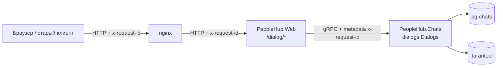

# Сервис диалогов

## Границы домена

Диалоги вынесены из монолита в отдельный сервис `PeopleHub.Chats` со своим процессом,
своим хранилищем (`pg-chats`, либо Tarantool под фиче-флагом) и своим контрактом.
В монолите не осталось ни таблиц диалогов, ни доменной логики: `PeopleHub.Web` знает
только gRPC-контракт соседа.



## Контракт

Взаимодействие — gRPC, `dialogs.proto` подключён обеими сторонами: сервером в
`PeopleHub.Chats` (`GrpcServices="Server"`) и клиентом в `PeopleHub.Web`
(`GrpcServices="Client"`), поэтому контракт физически один файл.

| RPC | Назначение |
|---|---|
| `Dialogs/Send` | Отправить сообщение, вернуть `message_id` |
| `Dialogs/List` | Вернуть переписку пары пользователей |
| `Dialogs/GetPartners` | Вернуть идентификаторы собеседников пользователя |

Сервис диалогов оперирует только идентификаторами пользователей: имена собеседников
для страницы чатов монолит подставляет сам из своей базы, чтобы не тянуть в сервис
чужой домен.

## Обратная совместимость

Старые клиенты продолжают ходить в монолит по тем же адресам и получают те же тела
ответов — переезд домена для них не виден. `DialogController` после выделения сервиса
стал HTTP-фасадом: проверяет параметры, вызывает gRPC и отдаёт прежний JSON.

| Эндпоинт монолита | Внутренний вызов | Тело ответа |
|---|---|---|
| `POST /dialog/{user_id}/send` | `Dialogs/Send` | строка `"Сообщение отправлено"` |
| `GET /dialog/{user_id}/list` | `Dialogs/List` | массив `{from, to, text}` |
| `GET /api/dialog/partners` | `Dialogs/GetPartners` + имена из базы монолита | массив `{id, name}` |

Прямого доступа к сервису чатов у внешних клиентов нет: порт `8081` слушает gRPC и
используется только монолитом и нагрузочными сценариями.

## Сквозное логирование (x-request-id)

1. Клиент присылает `x-request-id`. Браузерный клиент генерирует его сам
   (`frontend/src/api/client.ts`).
2. Если заголовка нет, его подставляет nginx (`$request_id`), уже пришедший — сохраняет.
3. `RequestIdMiddleware` в монолите читает заголовок, при отсутствии генерирует свой,
   кладёт значение в `HttpContext`, возвращает его в ответе и открывает logging scope.
4. `RequestIdClientInterceptor` добавляет то же значение в metadata gRPC-вызова.
5. `RequestIdServerInterceptor` в сервисе чатов достаёт его из metadata и открывает
   свой logging scope, поэтому все строки лога обоих сервисов сопоставимы по одному ключу.

| Звено | Код |
|---|---|
| Генерация на клиенте | `frontend/src/api/client.ts` |
| Генерация и проброс на входе | `docker/nginx/nginx.conf` |
| Middleware монолита | `PeopleHub.Web/Middleware/RequestIdMiddleware.cs` |
| Клиентский интерцептор | `PeopleHub.Web/Grpc/RequestIdClientInterceptor.cs` |
| Серверный интерцептор | `PeopleHub.Chats/Grpc/RequestIdServerInterceptor.cs` |

Проверка на поднятом стенде:

```bash
curl -s -i -X POST "http://localhost:8090/dialog/7/send" -H "Authorization: Bearer $TOKEN" -H "Content-Type: application/json" -H "x-request-id: demo-trace-42" -d '{"text":"hello"}'
```

Ответ возвращает тот же идентификатор:

```
HTTP/1.1 200 OK
x-request-id: demo-trace-42
```

`docker logs people-hub-nginx`:

```
172.18.0.1 - [29/Jul/2026:11:08:51 +0000] "POST /dialog/7/send HTTP/1.1" 200 x-request-id=demo-trace-42 0.081s
```

`docker logs people-hub-app`:

```
info: PeopleHub.Middleware.RequestIdMiddleware[0]
      => ... => x-request-id:demo-trace-42
      POST /dialog/7/send завершён со статусом 200 за 79 мс
```

`docker logs people-hub-chats`:

```
info: PeopleHub.Chats.Grpc.RequestIdServerInterceptor[0]
      => ... RequestPath:/dialogs.Dialogs/Send ... => x-request-id:demo-trace-42
      /dialogs.Dialogs/Send завершён со статусом OK за 53 мс
```

## Запуск

```bash
docker compose up -d --build
```

Контейнер `chats` объявляет healthcheck (TCP-проба порта `8081`), монолит стартует
только после того, как сервис диалогов стал `healthy`.
