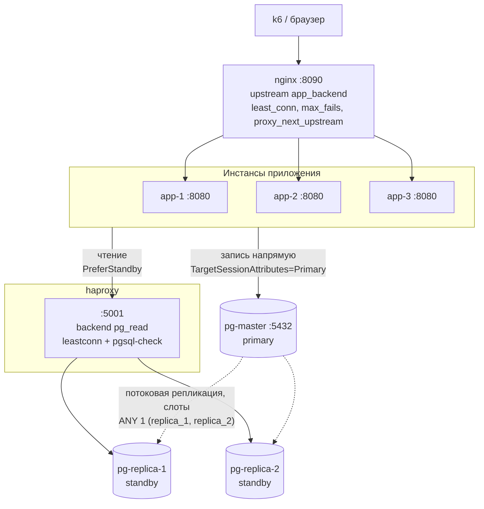

# Балансировка: nginx перед приложением, haproxy перед репликами

Строка подключения приложения: `Host=pg-master:5432,haproxy:5001`.
Npgsql выбирает хост по `TargetSessionAttributes` (см. `PeopleHub.Infrastructure/Db/DbClient.cs`):
запись уходит на мастер напрямую, чтение — на haproxy, который раскидывает его по живым репликам.
