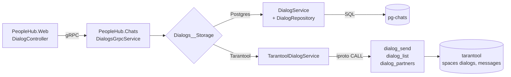

# Диалоги в In-Memory СУБД (Tarantool)

Модуль диалогов перенесён из PostgreSQL в Tarantool. Логика — нормализация пары
собеседников, создание диалога, выдача идентификаторов, валидация текста, сборка
списка сообщений и списка собеседников — живёт в хранимых Lua-функциях. Сервис
`PeopleHub.Chats` обращается к Tarantool **только** через `IPROTO_CALL`; прямого
доступа к спейсам у него нет, и он запрещён на уровне прав.

## Архитектура



Ключевая деталь: стрелка от `TarantoolDialogService` идёт в **функции**, а не в спейсы.
Пользователь `guest`, под которым подключается сервис, имеет только право `execute` на
четыре функции. Функции объявлены с `setuid = true`, поэтому читают и пишут спейсы от
имени владельца схемы.

## Схема и UDF

Всё в [docker/tarantool/init.lua](../docker/tarantool/init.lua):

| Объект | Назначение |
|---|---|
| space `dialogs` | `id, user_id1, user_id2`; индексы `primary(id)`, уникальный `pair(user_id1, user_id2)`, `by_user2(user_id2)` |
| space `messages` | `dialog_id, id, from_user_id, text, created_at`; `primary(dialog_id, id)` — сообщения одного диалога лежат рядом |
| sequences `dialogs_seq`, `messages_seq` | генерация идентификаторов |
| `dialog_send(from, to, text)` | валидация текста, нормализация пары, get-or-create диалога и вставка сообщения — одной транзакцией `box.atomic`, возвращает id сообщения |
| `dialog_list(u1, u2)` | поиск диалога по нормализованной паре и обход `messages` по префиксу `dialog_id` |
| `dialog_partners(user_id)` | обход по двум индексам (`pair` как префиксный по `user_id1` и `by_user2`), слияние и сортировка |
| `dialog_stats()` | счётчики для проверки готовности и диагностики |

Нормализация пары (`min(u1, u2), max(u1, u2)`) даёт один диалог на пару независимо от
того, кто пишет первым, — уникальный индекс `pair` это гарантирует на уровне СУБД.

Проверка, что напрямую спейсы недоступны:

```bash
docker exec tarantool tarantool -e "local nb = require('net.box').connect('127.0.0.1:3301'); print(nb.space.messages); os.exit(0)"
```

Выводит `nil`: у `guest` нет прав на чтение спейсов, схема ему даже не отдаётся.

## Где что лежит

| Шаг | Код |
|---|---|
| Спейсы, sequences, UDF, гранты | `docker/tarantool/init.lua` |
| Конфигурация инстанса (iproto, memtx, WAL) | `docker/tarantool/config.yaml` |
| Вызов UDF и разбор msgpack-ответов | `PeopleHub.Chats/Services/TarantoolDialogService.cs` |
| iproto-клиент: greeting, кадрирование, `IPROTO_CALL`, ошибки | `PeopleHub.Chats/Tarantool/TarantoolConnection.cs` |
| Пул соединений | `PeopleHub.Chats/Tarantool/TarantoolClient.cs` |
| Проверка доступности UDF на старте | `PeopleHub.Chats/Tarantool/TarantoolSchemaProbe.cs` |
| Выбор хранилища | `PeopleHub.Chats/Bootstrapper.cs` |
| Прежняя реализация на SQL (осталась для сравнения) | `PeopleHub.Chats/Services/DialogService.cs`, `Repositories/DialogRepository.cs` |

Готового живого клиента Tarantool под .NET нет (`progaudi.tarantool` заброшен), поэтому
клиент написан руками: 5-байтный префикс длины, msgpack-заголовок и тело, разбор
`IPROTO_DATA` / `IPROTO_ERROR_24`. Из msgpack используется только низкоуровневый
`MessagePackReader`/`MessagePackWriter`. Пул соединений — `SemaphoreSlim` на число
слотов плюс очередь простаивающих соединений; на ошибке протокола соединение
закрывается, на ошибке от Tarantool (например, пустой текст) — возвращается в пул.

## Запуск

```bash
docker compose up -d --build
```

По умолчанию диалоги работают на Tarantool. Вернуть прежнее хранилище (этим снимался
baseline «ДО»):

```bash
DIALOGS_STORAGE=Postgres docker compose up -d --build chats
```

И обратно:

```bash
DIALOGS_STORAGE=Tarantool docker compose up -d --build chats
```

Tarantool слушает `localhost:3301`, данные — в volume `tarantool-data`
(memtx + WAL, переживают рестарт контейнера).

## Методика нагрузочного тестирования

Сценарий: [load-testing/dialogs.js](../load-testing/dialogs.js), k6.

```bash
cd load-testing
RUN=2 REPORT=dialogs-before k6 run dialogs.js
```

Два параллельных сценария по 120 секунд:

* `reads` — 30 VU, `GET /dialog/{id}/list` по 40 заранее засеянным диалогам;
* `writes` — 10 VU, `POST /dialog/{id}/send` по 200 диалогам.

Чтобы прогоны были сопоставимы:

* сид идемпотентный — перед прогоном каждый читаемый диалог доводится ровно до
  50 сообщений, повторный запуск ничего не добавляет;
* записи каждого прогона идут в свой диапазон id (`RUN`), то есть всегда в свежие
  диалоги, а не в раздутые предыдущим прогоном;
* оба прогона — одна и та же машина, один и тот же профиль, тот же путь
  HTTP → nginx-less :8080 → gRPC → chats, менялось только хранилище.

Сырые сводки: [dialogs-before-summary.json](../load-testing/my-reports/dialogs-before-summary.json),
[dialogs-after-summary.json](../load-testing/my-reports/dialogs-after-summary.json).

## Результат: сквозной прогон через API

| Метрика | ДО (PostgreSQL) | ПОСЛЕ (Tarantool) | Δ |
|---|---|---|---|
| RPS суммарно | 650.2 | 695.0 | +6.9% |
| Ошибки | 0 | 0 | — |
| `send` RPS | 131.5 | 173.3 | +31.8% |
| `send` avg | 24.81 ms | 6.45 ms | −74% |
| `send` p95 | 83.45 ms | 11.41 ms | −86% |
| `send` p99 | 137.03 ms | 15.22 ms | −89% |
| `send` max | 219.79 ms | 34.33 ms | −84% |
| `list` RPS | 518.3 | 521.4 | +0.6% |
| `list` avg | 6.55 ms | 6.25 ms | −4.6% |
| `list` p95 | 11.25 ms | 11.02 ms | −2% |
| `list` p99 | 14.92 ms | 14.76 ms | −1% |
| `iteration_duration` p95 | 76.08 ms | 63.28 ms | −17% |

Запись ускорилась в разы, чтение практически не изменилось.

## Результат: только слой хранения

Сквозной прогон упирается в ASP.NET + gRPC + сериализацию, поэтому отдельно замерен
сам слой хранения, без HTTP: `pgbench` с двумя запросами на транзакцию (те же, что
делал `DialogRepository`) против Lua-бенчмарка, вызывающего UDF через `net.box`.
8 клиентов, 20 секунд, клиент в том же контейнере, что и сервер.

```bash
docker cp load-testing/storage-bench/pg-read.sql pg-chats:/tmp/pg-read.sql
docker exec pg-chats pgbench -n -f /tmp/pg-read.sql -c 8 -j 4 -T 20 -U postgres people_hub_chats

docker cp load-testing/storage-bench/tarantool-bench.lua tarantool:/tmp/bench.lua
docker exec -e BENCH_MODE=read -e BENCH_CONCURRENCY=8 -e BENCH_DURATION=20 tarantool tarantool -e "dofile('/tmp/bench.lua')"
```

| Операция | PostgreSQL | Tarantool | Δ |
|---|---|---|---|
| чтение диалога, TPS | 15 403 | 13 368 | −13% |
| чтение диалога, avg | 0.519 ms | 0.598 ms | +15% |
| отправка сообщения, TPS | 1 135 | 26 449 | ×23 |
| отправка сообщения, avg | 7.047 ms | 0.302 ms | −96% |
| отправка сообщения, p95 | — | 0.567 ms | — |

Потребление ресурсов под нагрузкой: Tarantool 22 МБ RSS и 3.6% CPU против 44 МБ и
5.0% у pg-chats при 26 тысячах сообщений в базе.

## Выводы

1. **Запись выиграла принципиально: ×23 по TPS слоя хранения и −86% по p95 сквозного
   `send`.** Причины две. Первая — Postgres по умолчанию делает fsync на каждый коммит
   (`synchronous_commit = on`), Tarantool сконфигурирован с `wal.mode: write`, то есть
   пишет WAL без fsync. Это осознанный компромисс по долговечности: при падении хоста
   можно потерять последние транзакции, при падении процесса — нет. Вторая — вся операция
   отправки стала одним round trip вместо двух, потому что get-or-create диалога и вставка
   сообщения выполняются внутри одной хранимой функции.
2. **Чтение не выиграло ничего, и это ожидаемо.** Рабочий набор диалогов целиком
   помещается в `shared_buffers`, так что PostgreSQL и так отвечал из памяти за 0.5 мс.
   На сквозном прогоне `list` в оба раза стоил ~6 мс — эти миллисекунды тратятся на HTTP,
   gRPC и сериализацию 50 сообщений, а не на СУБД. Переносом хранения такое не лечится;
   лечится кешированием ответа или сокращением числа хопов.
3. Суммарный RPS вырос всего на 7%, потому что в профиле нагрузки 80% запросов — чтения,
   а выиграли только записи. Смещение профиля в сторону записи увеличит разрыв.
4. Побочный, но важный эффект: логика в UDF убрала возможность рассогласования. Раньше
   «найти-или-создать диалог» и «вставить сообщение» были двумя отдельными запросами из
   .NET без общей транзакции; теперь это одна атомарная функция.

## Ограничения текущей реализации

* Один инстанс Tarantool, без репликации — переезд на replicaset обсуждается отдельно.
* `wal.mode: write` вместо `fsync` — см. вывод 1; для боевого профиля значение нужно
  выбирать осознанно.
* Подключение под `guest` без пароля. Прав достаточно ровно на вызов четырёх функций,
  но для внешнего контура нужен отдельный пользователь с паролем и `chap-sha1`.
* Данные из PostgreSQL в Tarantool не переносились: переключение хранилища начинает
  историю диалогов заново. Скрипт миграции в объём задания не входил.
