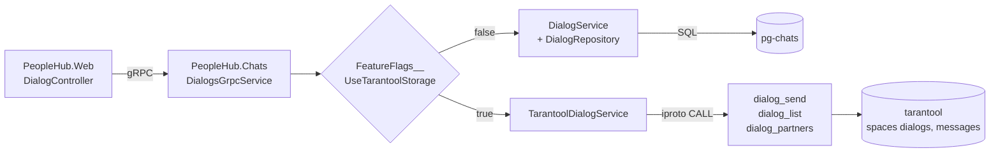

# Диалоги в In-Memory СУБД (Tarantool)

> **Статус: реализация откачена.** Tarantool убран из проекта, единственное хранилище
> диалогов — снова `pg-chats`. Отчёт оставлен как результат ДЗ по In-Memory СУБД:
> замеры и выводы ниже остаются в силе для того состояния кода. Рабочий код,
> `docker/tarantool/init.lua` и конфигурация инстанса лежат в истории на коммите
> `abdfdc2` — ссылки на файлы Tarantool ниже ведут на удалённые пути.

Модуль диалогов перенесён из PostgreSQL в Tarantool. Логика — нормализация пары
собеседников, создание диалога, выдача идентификаторов, валидация текста, сборка
списка сообщений и списка собеседников — живёт в хранимых Lua-функциях. Сервис
`PeopleHub.Chats` обращается к Tarantool **только** через `IPROTO_CALL`; прямого
доступа к спейсам у него нет, и он запрещён на уровне прав.

## Архитектура



Ключевая деталь: стрелка от `TarantoolDialogService` идёт в **функции**, а не в спейсы.
Пользователь `guest`, под которым подключается сервис, имеет только право `execute` на
четыре функции. Функции объявлены с `setuid = true`, поэтому читают и пишут спейсы от
имени владельца схемы.

## Схема и UDF

Всё в [docker/tarantool/init.lua](../docker/tarantool/init.lua):

| Объект | Назначение |
|---|---|
| space `dialogs` | `id, user_id1, user_id2`; индексы `primary(id)`, уникальный `pair(user_id1, user_id2)`, `by_user2(user_id2)` |
| space `messages` | `dialog_id, id, from_user_id, text, created_at`; `primary(dialog_id, id)` — сообщения одного диалога лежат рядом |
| sequences `dialogs_seq`, `messages_seq` | генерация идентификаторов |
| `dialog_send(from, to, text)` | валидация текста, нормализация пары, get-or-create диалога и вставка сообщения — одной транзакцией `box.atomic`, возвращает id сообщения |
| `dialog_list(u1, u2)` | поиск диалога по нормализованной паре и обход `messages` по префиксу `dialog_id` |
| `dialog_partners(user_id)` | обход по двум индексам (`pair` как префиксный по `user_id1` и `by_user2`), слияние и сортировка |
| `dialog_stats()` | счётчики для проверки готовности и диагностики |

Нормализация пары (`min(u1, u2), max(u1, u2)`) даёт один диалог на пару независимо от
того, кто пишет первым, — уникальный индекс `pair` это гарантирует на уровне СУБД.

Проверка, что напрямую спейсы недоступны:

```bash
docker exec tarantool tarantool -e "local nb = require('net.box').connect('127.0.0.1:3301'); print(nb.space.messages); os.exit(0)"
```

Выводит `nil`: у `guest` нет прав на чтение спейсов, схема ему даже не отдаётся.

## Где что лежит

| Шаг | Код |
|---|---|
| Спейсы, sequences, UDF, гранты | `docker/tarantool/init.lua` |
| Конфигурация инстанса (iproto, memtx, WAL) | `docker/tarantool/config.yaml` |
| Вызов UDF и разбор ответов | `PeopleHub.Chats/Services/TarantoolDialogService.cs` |
| Пул соединений | `PeopleHub.Chats/Tarantool/TarantoolConnectionPool.cs` |
| Проверка доступности UDF на старте | `PeopleHub.Chats/Tarantool/TarantoolSchemaProbe.cs` |
| Выбор хранилища | `PeopleHub.Chats/Bootstrapper.cs` |
| Прежняя реализация на SQL (осталась для сравнения) | `PeopleHub.Chats/Services/DialogService.cs`, `Repositories/DialogRepository.cs` |

### Клиент

Используется пакет [`nf.Tarantool`](https://github.com/RelaxSpirit/nanoFramework.Tarantool)
1.0.49 — единственный клиент Tarantool под .NET, который обновлялся в 2026 году
(`progaudi.tarantool` — 2023, остальные мертвы с 2017). Основная его цель — .NET
nanoFramework, но пакет собирается и под `net8.0`/`net9.0`.

Два свойства библиотеки, которые пришлось обойти:

* **API полностью синхронный** — ни одного метода, возвращающего `Task`. Вызов блокирует
  поток, поэтому `TarantoolConnectionPool` ограничивает число одновременно блокируемых
  потоков размером пула (`Dialogs:Tarantool:PoolSize`, по умолчанию 32). `CancellationToken`
  библиотека не принимает: у неё свой внутренний таймаут в 30 секунд.
* **Буфер чтения ограничен** — наследие микроконтроллеров. `dialog_list` отдаёт до
  нескольких десятков килобайт, поэтому `ReadStreamBufferSize` поднят до 256 КБ
  (`Dialogs:Tarantool:ReadBufferSize`).

Ответы приходят нетипизированными: вложенные `ArrayList`, числа боксированы в
минимальный подходящий тип (id `4` приезжает как `Byte`, `555308` — как `UInt32`),
отсюда `Convert.ToInt64` при разборе в `TarantoolDialogService`.

## Запуск

```bash
docker compose up -d --build
```

По умолчанию диалоги работают на Tarantool. Вернуть прежнее хранилище (этим снимался
baseline «ДО»):

```bash
USE_TARANTOOL_STORAGE=false docker compose up -d --build chats
```

И обратно:

```bash
USE_TARANTOOL_STORAGE=true docker compose up -d --build chats
```

Tarantool слушает `localhost:3301`, данные — в volume `tarantool-data`
(memtx + WAL, переживают рестарт контейнера).

## Методика нагрузочного тестирования

Сценарий: [load-testing/dialogs.js](../load-testing/dialogs.js), k6.

```bash
cd load-testing
RUN=2 REPORT=dialogs-before k6 run dialogs.js
```

Два параллельных сценария по 120 секунд:

* `reads` — 30 VU, `GET /dialog/{id}/list` по 40 заранее засеянным диалогам;
* `writes` — 10 VU, `POST /dialog/{id}/send` по 200 диалогам.

Чтобы прогоны были сопоставимы:

* сид идемпотентный — перед прогоном каждый читаемый диалог доводится ровно до
  50 сообщений, повторный запуск ничего не добавляет;
* записи каждого прогона идут в свой диапазон id (`RUN`), то есть всегда в свежие
  диалоги, а не в раздутые предыдущим прогоном;
* оба прогона — одна и та же машина, один и тот же профиль, тот же путь
  HTTP → nginx-less :8080 → gRPC → chats, менялось только хранилище;
* объём данных в обоих хранилищах выровнен: ~575.6 тыс. сообщений, 440 и 642 диалога
  (расхождение по диалогам — из-за прошлых прогонов, на нагрузку не влияет,
  читаемые и записываемые диапазоны id одинаковые);
* по три прогона на каждое хранилище, в таблицах ниже — медиана.

Сырые сводки в [my-reports](../load-testing/my-reports/): `dialogs-before-bulk`,
`pg-var-5`, `pg-var-6` для PostgreSQL и `dialogs-after-bulk`, `tt-var-5`, `tt-var-6`
для Tarantool.

## Результат: сквозной прогон через API

Три прогона на хранилище, ~575.6 тыс. сообщений в обоих, медиана:

| Метрика | ДО (PostgreSQL) | ПОСЛЕ (Tarantool) | Δ |
|---|---|---|---|
| RPS суммарно | 661.0 | 689.4 | +4.3% |
| `send` RPS | 146.4 | 171.2 | +16.9% |
| `send` med | 13.27 ms | 6.42 ms | −52% |
| `send` p95 | 35.65 ms | 13.61 ms | −62% |
| `send` p99 | 68.85 ms | 20.35 ms | −70% |
| `list` med | 6.30 ms | 6.05 ms | −4% |
| `list` p95 | 12.15 ms | 12.69 ms | +4% |
| Ошибки | 0 | 0 | — |

Запись ускорилась вдвое по медиане и втрое по хвостам, чтение не изменилось.

### Разброс между прогонами

Отдельный результат — предсказуемость. `send` p95 по трём одинаковым прогонам:

| Хранилище | Прогоны | Разброс |
|---|---|---|
| PostgreSQL | 28.45 / 58.40 / 35.65 ms | ×2.1 |
| Tarantool | 13.40 / 13.61 / 15.37 ms | ×1.15 |

Медиана `send` у PostgreSQL при этом стабильна (13.22 / 13.27 / 13.77 мс) — плавает
именно хвост. Причина в fsync на коммите: длительность зависит от того, попал ли
коммит в чекпойнт и как в этот момент ведёт себя дисковый стек Docker Desktop.
У Tarantool с `wal.mode: write` этой зависимости нет.

Практический вывод по методике: **одиночный прогон для `send` p95 в PostgreSQL
недостоверен**. Первый снятый baseline дал 83.45 мс — это верхний край разброса,
и построенный на нём вывод «−86%» был завышен. Честная цифра — −62%.

### Замер на слое gRPC

Сквозной прогон через `:8080` тратит на хранилище меньше 7% бюджета запроса — остальное
уходит на HTTP, разбор JWT, роутинг ASP.NET, gRPC-хоп и сборку JSON из 50 сообщений.
На таком фоне разница между хранилищами не видна. Поэтому снят второй набор замеров —
[load-testing/dialogs-grpc.js](../load-testing/dialogs-grpc.js) бьёт напрямую в
`chats:8081`, минуя веб-слой:

```bash
cd load-testing
RUN=7 REPORT=grpc-pg-7 k6 run dialogs-grpc.js
```

Профиль тот же: 30 VU на `Dialogs/List`, 10 VU на `Dialogs/Send`, 120 секунд,
по три прогона на хранилище, в таблице медиана.

| | PostgreSQL | Tarantool | Δ |
|---|---|---|---|
| `Dialogs/List` med | 3.45 ms | 2.88 ms | −16.4% |
| `Dialogs/List` p95 | 7.56 ms | 7.00 ms | −7.4% |
| `Dialogs/List` p99 | 11.12 ms | 11.17 ms | +0.5% |
| `Dialogs/Send` med | 12.24 ms | 2.99 ms | −75.5% |
| `Dialogs/Send` p95 | 70.58 ms | 6.80 ms | −90.4% |
| `Dialogs/Send` p99 | 79.86 ms | 11.40 ms | −85.7% |

### Что из этого следует

**Запись стала вчетверо быстрее и в десять раз предсказуемее.** Медиана упала с 12.24
до 2.99 мс, а хвост — с 70.58 до 6.80 мс. Причин две. Первая: PostgreSQL на каждый
коммит делает fsync, то есть ждёт физической записи на диск, и длительность этого
ожидания зависит от того, чем занят диск в этот момент — отсюда и разлетающийся хвост.
Tarantool пишет WAL без fsync, ждать нечего. Вторая: раньше отправка сообщения была
двумя запросами по сети — сначала «найти или создать диалог», потом «вставить
сообщение». Теперь это один вызов хранимой процедуры, и оба действия происходят внутри
базы в одной транзакции.

**Чтение почти не изменилось.** −16% по медиане и полное равенство на хвосте. Причина
простая: PostgreSQL здесь тоже отвечает из памяти — рабочий набор диалогов помещается
в `shared_buffers`, до диска дело не доходит. Сравнивать «in-memory» с «тоже in-memory»
особого смысла нет, разница в полмиллисекунды приходится на протокол и разбор ответа,
а не на поиск данных.

**Разброс важнее средних.** У Tarantool медиана, p95 и p99 записи лежат рядом:
2.99 / 6.80 / 11.40 мс. У PostgreSQL те же три числа расходятся в шесть раз:
12.24 / 70.58 / 79.86 мс. Для SLA это обычно значит больше, чем выигрыш в среднем.

**Для системы в целом эффект умеренный.** Диалоги — модуль с преобладанием чтений
(в нашем профиле 75% запросов), а выиграли только записи. Пользователь заметит разницу
не в обычной работе, а на всплесках отправки сообщений, когда у PostgreSQL начинал
разъезжаться хвост.

**Главное здесь — знак у чтения.** На HTTP-слое `list` у Tarantool выглядел на 4% хуже,
на gRPC-слое он на 16% лучше по медиане. То есть Tarantool не медленнее на чтении:
разницу съедали 8 миллисекунд веб-слоя, одинаковые для обоих хранилищ, плюс накладные
расходы клиента `nf.Tarantool` (боксинг при разборе `dialog_list`).

Оговорка: у PostgreSQL хвост записи в этих прогонах лёг в диапазон 55.70–72.79 мс против
28.45–58.40 мс на HTTP-слое. Диапазоны не пересекаются, при этом писалось даже меньше
(140.6 против 150.8 запросов в секунду). Достоверного объяснения у меня нет — кандидаты
это рост таблицы между сериями замеров (109 МБ против 90 МБ) и разброс дискового стека
Docker Desktop. На вывод это не влияет: у Tarantool та же метрика 6.46–7.08 мс во всех
шести прогонах обеих серий.

### Влияние объёма данных

Тот же сценарий при 26 тыс. и 576 тыс. сообщений (одиночные прогоны, `list` p95):

| Объём | PostgreSQL | Tarantool |
|---|---|---|
| ~26 тыс. сообщений | 11.25 ms | 13.50 ms |
| ~576 тыс. сообщений | 12.07 ms | 12.69 ms |

Рост объёма в 10 раз не сдвинул чтение ни у одного из хранилищ. Ожидаемо: поиск идёт
по индексу, а рабочий набор в обоих случаях остаётся в памяти — 90 МБ таблицы с
индексами против 128 МБ `shared_buffers` у PostgreSQL и 67 МБ RSS при лимите
`memtx.memory` 512 МБ у Tarantool.

### Цена выбора клиента

Ранее тот же сценарий прогонялся на самописном асинхронном iproto-клиенте
([dialogs-after-summary.json](../load-testing/my-reports/dialogs-after-summary.json)).
Сравнение двух клиентов на одинаковой нагрузке:

| Метрика | самописный async | `nf.Tarantool` |
|---|---|---|
| RPS суммарно | 695.0 | 679.4 |
| `list` p95 | 11.02 ms | 13.50 ms |
| `list` p99 | 14.76 ms | 21.20 ms |
| `list` max | 34 ms | 9994 ms |
| `send` p95 | 11.41 ms | 14.78 ms |
| Ошибки | 0 из 83 571 | 1 из 81 898 |

Прогоны сняты при ~26 тыс. сообщений, по одному на клиента, поэтому к разнице в
перцентилях применима та же оговорка про разброс.

Изолированный замер пропускной способности (40 конкурентных вызовов `dialog_list`
с хоста): самописный клиент — 6188 оп/с, `nf.Tarantool` — 2474 оп/с с отдельным
подключением на воркер и 1809 оп/с с общим. Разрыв в 2.5 раза объясняется
синхронным API и боксингом при разборе ответов.

На нашем профиле (~700 rps) обе реализации работают с запасом, поэтому разница в
сквозных перцентилях невелика. Выбор в пользу библиотеки — меньше своего кода
в сопровождении.

## Результат: только слой хранения

Сквозной прогон упирается в ASP.NET + gRPC + сериализацию, поэтому отдельно замерен
сам слой хранения, без HTTP: `pgbench` с двумя запросами на транзакцию (те же, что
делал `DialogRepository`) против Lua-бенчмарка, вызывающего UDF через `net.box`.
8 клиентов, 20 секунд, клиент в том же контейнере, что и сервер.

```bash
docker cp load-testing/storage-bench/pg-read.sql pg-chats:/tmp/pg-read.sql
docker exec pg-chats pgbench -n -f /tmp/pg-read.sql -c 8 -j 4 -T 20 -U postgres people_hub_chats

docker cp load-testing/storage-bench/tarantool-bench.lua tarantool:/tmp/bench.lua
docker exec -e BENCH_MODE=read -e BENCH_CONCURRENCY=8 -e BENCH_DURATION=20 tarantool tarantool -e "dofile('/tmp/bench.lua')"
```

| Операция | PostgreSQL | Tarantool | Δ |
|---|---|---|---|
| чтение диалога, TPS | 15 403 | 13 368 | −13% |
| чтение диалога, avg | 0.519 ms | 0.598 ms | +15% |
| отправка сообщения, TPS | 1 135 | 26 449 | ×23 |
| отправка сообщения, avg | 7.047 ms | 0.302 ms | −96% |
| отправка сообщения, p95 | — | 0.567 ms | — |

Потребление ресурсов под нагрузкой: Tarantool 22 МБ RSS и 3.6% CPU против 44 МБ и
5.0% у pg-chats при 26 тысячах сообщений в базе.

## Выводы

1. **Запись выиграла принципиально: ×23 по TPS слоя хранения, −52% по медиане и −62%
   по p95 сквозного `send`.** Причины две. Первая — Postgres по умолчанию делает fsync на каждый коммит
   (`synchronous_commit = on`), Tarantool сконфигурирован с `wal.mode: write`, то есть
   пишет WAL без fsync. Это осознанный компромисс по долговечности: при падении хоста
   можно потерять последние транзакции, при падении процесса — нет. Вторая — вся операция
   отправки стала одним round trip вместо двух, потому что get-or-create диалога и вставка
   сообщения выполняются внутри одной хранимой функции.
2. **Чтение не выиграло ничего на сквозном прогоне — но не потому, что Tarantool медленнее.**
   Рабочий набор диалогов целиком помещается в `shared_buffers`, так что PostgreSQL и так
   отвечает из памяти. На сквозном прогоне `list` в оба раза стоил ~6 мс, и эти миллисекунды
   тратятся на HTTP, JWT, gRPC и сериализацию 50 сообщений, а не на СУБД. Стоит убрать
   веб-слой — и Tarantool оказывается на 16% быстрее по медиане. То есть выигрыш на чтении
   есть, он просто на порядок меньше накладных расходов вокруг. Лечится кешированием
   ответа или сокращением числа хопов, а не переносом хранения.
3. Суммарный RPS вырос всего на 4%, потому что в профиле нагрузки 75% запросов — чтения,
   а выиграли только записи. Смещение профиля в сторону записи увеличит разрыв.
4. **Tarantool предсказуемее.** Хвост записи у PostgreSQL гуляет вдвое между одинаковыми
   прогонами, у Tarantool держится в пределах 15%. Для SLA это иногда важнее средних цифр.
5. Побочный, но важный эффект: логика в UDF убрала возможность рассогласования. Раньше
   «найти-или-создать диалог» и «вставить сообщение» были двумя отдельными запросами из
   .NET без общей транзакции; теперь это одна атомарная функция.

## Ограничения текущей реализации

* Один инстанс Tarantool, без репликации — переезд на replicaset обсуждается отдельно.
* `wal.mode: write` вместо `fsync` — см. вывод 1; для боевого профиля значение нужно
  выбирать осознанно.
* Подключение под `guest` без пароля. Прав достаточно ровно на вызов четырёх функций,
  но для внешнего контура нужен отдельный пользователь с паролем и `chap-sha1`.
* Данные из PostgreSQL в Tarantool не переносились: переключение хранилища начинает
  историю диалогов заново. Скрипт миграции в объём задания не входил.
* Синхронный API `nf.Tarantool` блокирует поток на время вызова и игнорирует
  `CancellationToken`: отмена запроса клиентом не освобождает поток, ждать придётся
  внутренний таймаут библиотеки. При заметном росте нагрузки это первое, во что упрёмся.
