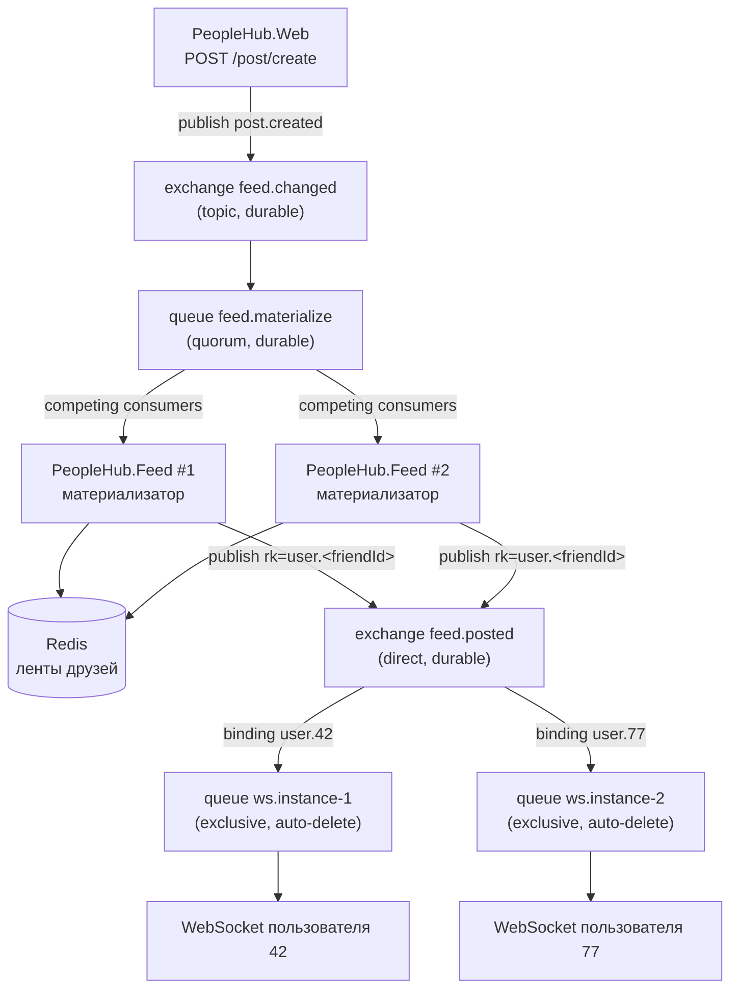

# Онлайн-обновление ленты новостей

## Архитектура



Поток события:

1. `PeopleHub.Web` при создании поста публикует `FeedEvent` в `feed.changed`
   (`PostEventPublishingDecorator` → `RabbitFeedEventPublisher`). Сообщения persistent,
   публикация идёт с publisher confirms.
2. Реплики `PeopleHub.Feed` разбирают очередь `feed.materialize` как competing consumers:
   получают список друзей автора, обновляют ленты в Redis (отложенная материализация)
   и публикуют персональное событие в `feed.posted` с routing key `user.<friendId>`.
3. Каждая реплика `PeopleHub.Feed` держит свою очередь `ws.<host>.<guid>`
   (`exclusive`, `auto-delete`) и биндит на неё ключ `user.<id>` только для тех
   пользователей, чьи WebSocket-соединения открыты именно на этой реплике.
4. Сообщение из очереди уходит в сокеты пользователя в формате AsyncAPI-спецификации:
   `{"postId": "...", "postText": "...", "author_user_id": "..."}`.

## Почему сервис вебсокетов масштабируется линейно

- Fan-out по друзьям выполняется **один раз** в материализаторе, а не на каждой WS-реплике.
- Реплика получает только те события, на которые сама подписалась: одно связывание
  `user.<id>` на подключённого пользователя. Реплика без подключений не получает ничего
  и даже не создаёт очередь.
- Нагрузка на реплику пропорциональна числу её соединений, а не общему трафику кластера.
  Для сравнения: при широковещательной рассылке (Redis pub/sub на общий канал) каждая
  реплика получала бы все события системы, и добавление реплик не снижало бы нагрузку.
- Состояние соединения локально, sticky-сессии не нужны: маршрутизация обеспечивается
  связываниями в RabbitMQ, а не балансировщиком.
- Очереди WS-реплик `exclusive` + `auto-delete`: при падении реплики очередь и её
  связывания удаляются автоматически, клиент переподключается к любой другой реплике
  и подписка восстанавливается.
- При обрыве соединения с брокером реплика пересоздаёт очередь и заново биндит всех
  пользователей, которые в этот момент подключены (`FeedSubscriber.EnsureChannelAsync`).

Масштабирование ограничено сверху числом связываний в `feed.posted` — это суммарное
число онлайн-пользователей. Когда одного обменника станет мало, его шардируют по
`userId` (см. [rabbitmq-scaling.md](rabbitmq-scaling.md)).

## Запуск

```bash
docker compose up -d --build --scale feed=2
```

Приложение доступно на `http://localhost:8090` (nginx). Nginx проксирует
`/post/feed/posted` на реплики `feed`, остальное — на `app`. Балансировка между
репликами идёт через встроенный DNS Docker (`resolver 127.0.0.11`), поэтому
`--scale feed=N` подхватывается без правки конфигурации.

Панель RabbitMQ: `http://localhost:15672` (guest/guest).

## Проверка

1. Зарегистрировать двух пользователей, добавить их в друзья.
2. Открыть у обоих вкладку «Лента» — бейдж должен показывать «Обновляется в реальном времени».
3. Создать пост от первого пользователя (`POST /post/create`).
4. У второго пост появляется в ленте без перезагрузки страницы.
5. В RabbitMQ на вкладке Exchanges → `feed.posted` видно связывание `user.<id>`,
   которое появляется при подключении сокета и исчезает при его закрытии.

Проверка изоляции: третий пользователь, не состоящий в друзьях, событие не получает —
его routing key просто не совпадает.
