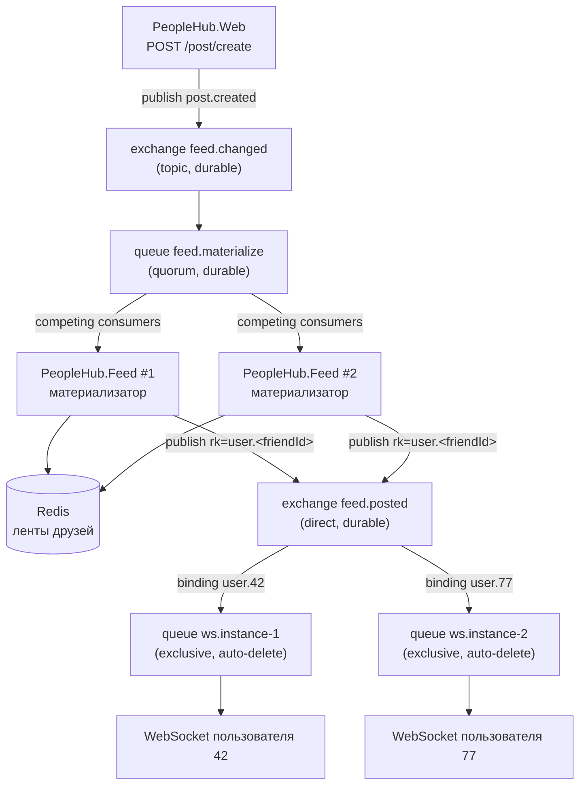

# Онлайн-обновление ленты новостей

## Архитектура



Поток события:

1. `PeopleHub.Web` при создании поста публикует `FeedEvent` в `feed.changed`
   (`PostEventPublishingDecorator` → `RabbitFeedEventPublisher`). Сообщения persistent,
   публикация идёт с publisher confirms.
2. Экземпляры `PeopleHub.Feed` разбирают очередь `feed.materialize` как competing consumers:
   получают список друзей автора, обновляют ленты в Redis (отложенная материализация)
   и публикуют персональное событие в `feed.posted` с routing key `user.<friendId>`.
3. Каждый экземпляр `PeopleHub.Feed` (один контейнер сервиса `feed`) держит свою очередь
   `ws.<host>.<guid>` (`exclusive`, `auto-delete`) и биндит на неё ключ `user.<id>` только
   для тех пользователей, чьи WebSocket-соединения открыты именно на нём.
4. Сообщение из очереди уходит в сокеты пользователя в формате AsyncAPI-спецификации:
   `{"postId": "...", "postText": "...", "author_user_id": "..."}`.

## Где что лежит

| Шаг | Код |
|---|---|
| Публикация `FeedEvent` при создании, правке и удалении поста | `PeopleHub.Infrastructure/Messaging/PostEventPublishingDecorator.cs` → `RabbitFeedEventPublisher.cs` |
| Имена обменников, очередей и routing key | `PeopleHub.Infrastructure/Messaging/FeedTopology.cs` |
| Материализация ленты в Redis и рассылка персональных событий | `PeopleHub.Feed/Services/FeedMaterializerWorker.cs` |
| Публикация события в `feed.posted` с ключом `user.<id>` | `PeopleHub.Feed/Services/FeedNotificationPublisher.cs` |
| Очередь экземпляра, связывания `user.<id>`, приём сообщений | `PeopleHub.Feed/WebSockets/FeedSubscriber.cs` |
| Реестр открытых сокетов по пользователям | `PeopleHub.Feed/WebSockets/FeedConnectionRegistry.cs` |
| Запись байтов в сокет | `PeopleHub.Feed/WebSockets/FeedConnection.cs` |
| HTTP-эндпоинт и апгрейд до WebSocket | `PeopleHub.Feed/WebSockets/FeedWebSocketEndpoint.cs` |
| Клиентское подключение и переподключение | `frontend/src/api/feedSocket.ts` |

Пути к бэкенду указаны относительно `src/backend`, к фронтенду — относительно `src`.

В `PeopleHub.Infrastructure` остаётся только то, что нужно обоим сервисам: подключение к
брокеру, топология и контракт `FeedEvent`. Всё, что относится к доставке в сокеты, лежит
в `PeopleHub.Feed`.

Прямого вызова между публикатором и сокетом в коде нет: `FeedNotificationPublisher`
кладёт сообщение в обменник, а `FeedSubscriber` читает его из своей очереди. Связывает
их единственная строка — routing key `user.<id>`, которую обе стороны получают из
`FeedTopology.UserRoutingKey`. Байты из RabbitMQ уходят в сокет без пересериализации,
поэтому формат сообщения задан один раз, на стороне публикатора.

## Почему сервис вебсокетов масштабируется линейно

- Fan-out по друзьям выполняется **один раз** в материализаторе, а не в каждом экземпляре.
- Экземпляр получает только те события, на которые сам подписался: одно связывание
  `user.<id>` на подключённого пользователя. Экземпляр без подключений не получает ничего
  и даже не создаёт очередь.
- Нагрузка на экземпляр пропорциональна числу его соединений, а не общему трафику
  системы. Для сравнения: при широковещательной рассылке (Redis pub/sub на общий канал)
  каждый экземпляр получал бы все события, и добавление экземпляров не снижало бы нагрузку.
- Состояние соединения локально, sticky-сессии не нужны: маршрутизация обеспечивается
  связываниями в RabbitMQ, а не балансировщиком.
- Очереди `ws.*` объявлены `exclusive` + `auto-delete`: при падении экземпляра очередь и
  её связывания удаляются автоматически, клиент переподключается к любому другому
  экземпляру и подписка восстанавливается.
- При обрыве соединения с брокером экземпляр пересоздаёт очередь и заново биндит всех
  пользователей, которые в этот момент подключены (`FeedSubscriber.EnsureChannelAsync`).

Масштабирование ограничено сверху числом связываний в `feed.posted` — это суммарное
число онлайн-пользователей. Когда одного обменника станет мало, его шардируют по
`userId` (см. [rabbitmq-scaling.md](rabbitmq-scaling.md)).

## Запуск

```bash
docker compose up -d --build --scale feed=2
```

Приложение доступно на `http://localhost:8090` (nginx). Nginx проксирует
`/post/feed/posted` на экземпляры `feed`, остальное — на `app`. Балансировка между
ними идёт через встроенный DNS Docker (`resolver 127.0.0.11`), поэтому
`--scale feed=N` подхватывается без правки конфигурации.

Панель RabbitMQ: `http://localhost:15672` (guest/guest).

## Проверка

1. Зарегистрировать двух пользователей, добавить их в друзья.
2. Открыть у обоих вкладку «Лента» — бейдж должен показывать «Обновляется в реальном времени».
3. Создать пост от первого пользователя (`POST /post/create`).
4. У второго пост появляется в ленте без перезагрузки страницы.
5. В RabbitMQ на вкладке Exchanges → `feed.posted` видно связывание `user.<id>`,
   которое появляется при подключении сокета и исчезает при его закрытии.

Проверка изоляции: третий пользователь, не состоящий в друзьях, событие не получает —
его routing key просто не совпадает.
