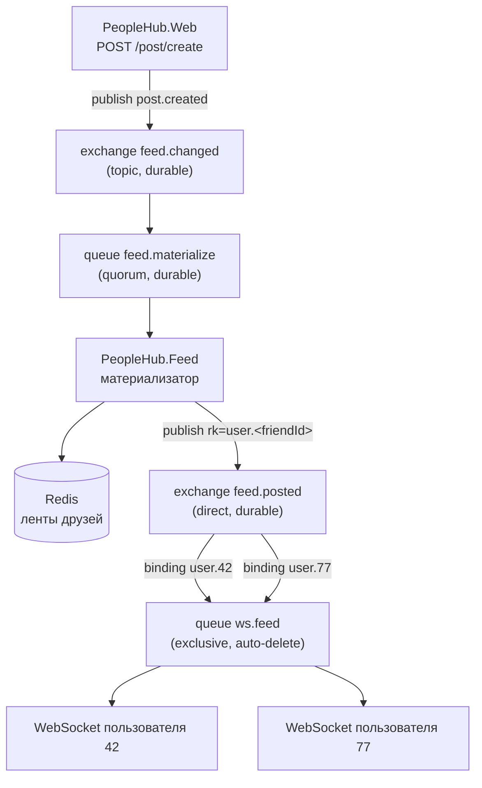

# Онлайн-обновление ленты новостей

## Архитектура



Поток события:

1. `PeopleHub.Web` при создании поста публикует `FeedEvent` в `feed.changed`
   (`PostEventPublishingDecorator` → `RabbitFeedEventPublisher`). Сообщения persistent,
   публикация идёт с publisher confirms.
2. `PeopleHub.Feed` разбирает очередь `feed.materialize`: получает список друзей автора,
   обновляет ленты в Redis (отложенная материализация) и публикует персональное событие
   в `feed.posted` с routing key `user.<friendId>`.
3. Тот же сервис держит очередь `ws.feed` (`exclusive`, `auto-delete`) и биндит на неё
   ключ `user.<id>` только для тех пользователей, чьи WebSocket-соединения сейчас открыты.
   Связывание появляется при подключении сокета и снимается при его закрытии.
4. Сообщение из очереди уходит в сокеты пользователя в формате AsyncAPI-спецификации:
   `{"postId": "...", "postText": "...", "author_user_id": "..."}`.

## Где что лежит

| Шаг | Код |
|---|---|
| Публикация `FeedEvent` при создании, правке и удалении поста | `PeopleHub.Infrastructure/Messaging/PostEventPublishingDecorator.cs` → `RabbitFeedEventPublisher.cs` |
| Имена обменников, очередей и routing key | `PeopleHub.Infrastructure/Messaging/FeedTopology.cs` |
| Материализация ленты в Redis и рассылка персональных событий | `PeopleHub.Feed/Services/FeedMaterializerWorker.cs` |
| Публикация события в `feed.posted` с ключом `user.<id>` | `PeopleHub.Feed/Services/FeedNotificationPublisher.cs` |
| Очередь `ws.feed`, связывания `user.<id>`, приём сообщений | `PeopleHub.Feed/WebSockets/FeedSubscriber.cs` |
| Реестр открытых сокетов по пользователям | `PeopleHub.Feed/WebSockets/FeedConnectionRegistry.cs` |
| Запись байтов в сокет | `PeopleHub.Feed/WebSockets/FeedConnection.cs` |
| HTTP-эндпоинт и апгрейд до WebSocket | `PeopleHub.Feed/WebSockets/FeedWebSocketEndpoint.cs` |
| Клиентское подключение и переподключение | `frontend/src/api/feedSocket.ts` |

Пути к бэкенду указаны относительно `src/backend`, к фронтенду — относительно `src`.

В `PeopleHub.Infrastructure` остаётся только то, что нужно обоим сервисам: подключение к
брокеру, топология и контракт `FeedEvent`. Всё, что относится к доставке в сокеты, лежит
в `PeopleHub.Feed`.

Прямого вызова между публикатором и сокетом в коде нет: `FeedNotificationPublisher`
кладёт сообщение в обменник, а `FeedSubscriber` читает его из своей очереди. Связывает
их единственная строка — routing key `user.<id>`, которую обе стороны получают из
`FeedTopology.UserRoutingKey`. Байты из RabbitMQ уходят в сокет без пересериализации,
поэтому формат сообщения задан один раз, на стороне публикатора.

## Адресная маршрутизация

Развёртывание рассчитано на **один экземпляр** `PeopleHub.Feed`: имя очереди `ws.feed`
задано константой в `FeedSubscriber`, и очередь объявлена `exclusive`, поэтому второй
экземпляр объявить её повторно не сможет.

Ключевое свойство схемы при этом не в числе экземпляров, а в том, что сервис получает
из брокера только адресованные ему события:

- Fan-out по друзьям выполняется **один раз** в материализаторе, а не при доставке.
- В очередь попадают только события с ключами `user.<id>`, на которые есть связывание,
  то есть только по пользователям с открытым сокетом. События по всем остальным
  RabbitMQ отбрасывает сам, до сети и до приложения.
- Альтернатива без маршрутизации — широковещательная рассылка (Redis pub/sub на общий
  канал): тогда сервис принимал бы все события системы и фильтровал их сам.
- Состояние соединения локально, sticky-сессии не нужны: адресация обеспечивается
  связываниями в RabbitMQ, а не балансировщиком.
- Очередь `exclusive` + `auto-delete`: при остановке сервиса она и её связывания
  удаляются автоматически, мусор в брокере не накапливается.
- При обрыве соединения с брокером сервис пересоздаёт очередь и заново биндит всех
  пользователей, которые в этот момент подключены (`FeedSubscriber.EnsureChannelAsync`).

Если понадобится горизонтальный рост, менять нужно ровно одно место: имя очереди в
`FeedSubscriber` сделать уникальным на процесс (например `ws.<hostname>.<guid>`). Тогда
каждый экземпляр заведёт свою очередь и подпишется только на своих пользователей, а
нагрузка на экземпляр станет пропорциональна числу его соединений, а не общему трафику.
Балансировщик при этом никакой особой настройки не требует — см. раздел про nginx ниже.
Верхняя граница такого роста — число связываний в `feed.posted`, равное числу
онлайн-пользователей; дальше обменник шардируют по `userId`
(см. [rabbitmq-scaling.md](rabbitmq-scaling.md)).

## Запуск

```bash
docker compose up -d --build
```

Приложение доступно на `http://localhost:8090` (nginx). Nginx проксирует
`/post/feed/posted` на `feed`, остальное — на `app`. Адрес бэкенда резолвится не при
старте, а на каждый запрос, через встроенный DNS Docker (`resolver 127.0.0.11` и
переменная в `proxy_pass`): иначе nginx запомнил бы IP навсегда и отвечал бы 502 после
любого пересоздания контейнера `feed`.

Панель RabbitMQ: `http://localhost:15672` (guest/guest).

## Проверка

1. Зарегистрировать двух пользователей, добавить их в друзья.
2. Открыть у обоих вкладку «Лента» — бейдж должен показывать «Обновляется в реальном времени».
3. Создать пост от первого пользователя (`POST /post/create`).
4. У второго пост появляется в ленте без перезагрузки страницы.
5. В RabbitMQ на вкладке Exchanges → `feed.posted` видно связывание `user.<id>`,
   которое появляется при подключении сокета и исчезает при его закрытии.

Проверка изоляции: третий пользователь, не состоящий в друзьях, событие не получает —
его routing key просто не совпадает.
