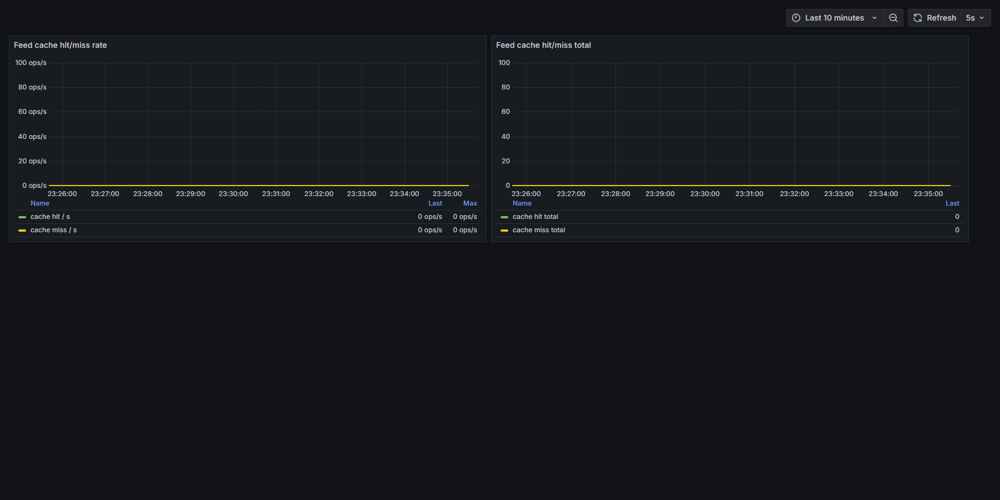
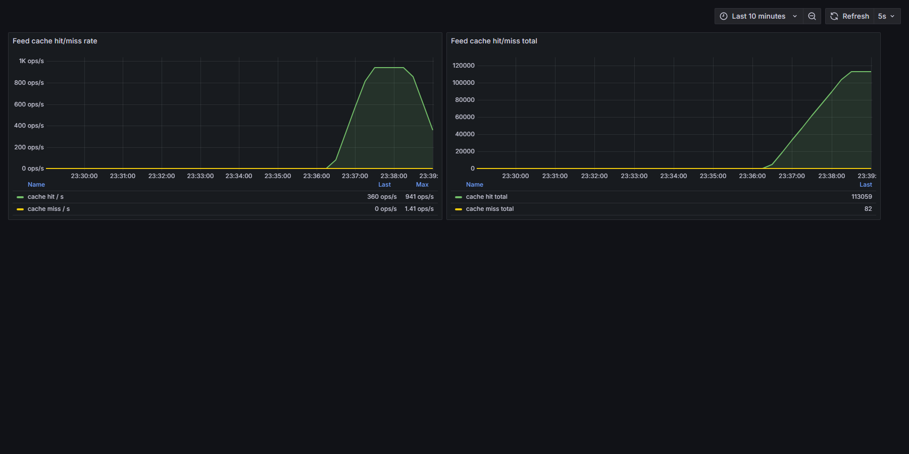

# Нагрузочное тестирование api/post/feed: кэш ленты (фичафлаг UseCacheForFeed)

## Сценарий

- Скрипт: [feed.js](../feed.js), k6 v2.1.0
- Нагрузка: 100 одновременных VU (constant-vus), 2 минуты, think time 100 мс
- Пользователи: 10 аккаунтов с лентами 30–39 постов (см. [seed-feed-users.sql](../seed-feed-users.sql)), JWT генерируется в скрипте
- Проверки: HTTP 200 и размер ленты 30–40 постов
- Метрики кэша: счётчики Prometheus `feed_cache_hits_total` / `feed_cache_misses_total`, дашборд Grafana «Feed Cache» (http://localhost:3000/d/feed-cache)

Перед каждым прогоном Redis очищался (`flushall`). Фичафлаг переключался в `appsettings.Development.json` без рестарта приложения (горячая перезагрузка конфига через IOptionsMonitor).

## Результаты

| Метрика | Прогон 1: FF off (только БД) | Прогон 2: FF on (Redis-кэш) |
|---|---|---|
| Итераций / RPS | 105 806 / 881 | 113 139 / 942 |
| Ошибки HTTP | **8.53 %** (9 027 из 105 806) | **0 %** |
| avg | 12.49 мс | 5.23 мс |
| med | 5.44 мс | 4.49 мс |
| p90 | 11.01 мс | 8.5 мс |
| p95 | 13.68 мс | 10.03 мс |
| p99 | 22.23 мс | 14.95 мс |
| max | **5.9 с** | 141.74 мс |
| cache hit | 0 | 113 059 |
| cache miss | 0 | 82 |

Сырые данные: [feed-run1-ff-off.txt](feed-run1-ff-off.txt), [feed-run1-ff-off-summary.json](feed-run1-ff-off-summary.json), [feed-run2-ff-on.txt](feed-run2-ff-on.txt), [feed-run2-ff-on-summary.json](feed-run2-ff-on-summary.json).

## Скриншоты Grafana

Прогон 1 — кэш выключен, оба счётчика на нуле в течение всего теста:

Прогон 2 — после 82 промахов на холодном старте (одновременный заход 100 VU на непрогретый кэш) все запросы обслуживаются из Redis, hit rate выходит на ~941 ops/s:

## Выводы

1. Без кэша каждый запрос ленты идёт в PostgreSQL. Под 100 одновременными пользователями путь «только БД» упирается в пул соединений Npgsql: в логах приложения массовые `NpgsqlException: No suitable host was found`, отсюда 8.5 % ошибок и хвост латентности до 5.9 с.
2. С включённым UseCacheForFeed БД нужна только для прогрева (82 промаха при холодном старте), дальше все ~113 тысяч запросов читаются из Redis: ноль ошибок, p99 меньше 15 мс, максимум 142 мс, пропускная способность выросла с 881 до 942 RPS (упёрлись в think time сценария, а не в сервер).
3. Средняя латентность снизилась в ~2.4 раза (12.49 → 5.23 мс), а главное — исчезла деградация под конкурентной нагрузкой: доля hit составила 99.93 %.
